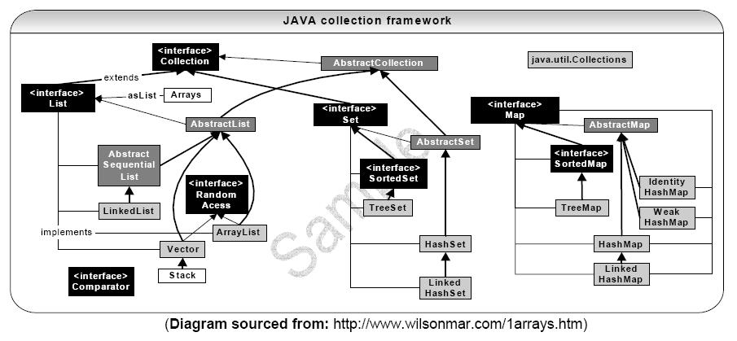

# Java 基础
	* Object and basic 
		* 基础数据结构
			* Collections
			* Map
			http://wiki.jikexueyuan.com/project/java-interview-bible/images/collection.jpg
			* List, Map, Set 实现类的底层实现原理，实现类的优缺点
			* CopyOnWrite容器和QUEUE
			* ConcurrentHashMap
				* ConcurrentHashMap的锁分段技术
				* ConcurrentHashMap的读是否要加锁，为什么
				* ConcurrentHashMap的迭代器是强一致性的还是弱一致性的
		* 搜索算法
			* hash
	* 基础API
		* 为什么String是不可改变的
			* in String class, it uses final char array to store the value, which is private, and has not getter or setter method. This guarantees that the String class is immutable.
			* 好处:
				* It's easier to create, use and test.
				* Thread safe.
				* Java中String对象的哈希码被频繁地使用, 比如在hashMap 等容器中。将String类设置为不可变的，允许String对象缓存HashCode。这是一种优化手段。
				* String被许多的Java类(库)用来当做参数,例如 网络连接地址URL,文件路径path,还有反射机制所需要的String参数等, 假若String不是固定不变的,将会引起各种安全隐患。
	* 基础语法
		* static, final, transient 等关键字
		* transient: 你只需要实现Serilizable接口，将不需要序列化的属性前添加关键字transient，序列化对象的时候，这个属性就不会序列化到指定的目的地中。
		* foreach 循环的原理
	* JAVA命令和系统命令
		* JAVA内存模型
			* 内存屏障
				* 单例模式DL
					* 双重锁，指令逃逸
					* 静态内部类
	* JVM
		* 内存布局
		* GC算法和几种垃圾收集器
		* OOM出现的原因和解决方法
		https://www.jianshu.com/p/2fdee831ed03
		* 类加载机制，也就是双亲委派模型
			* Bootstrap ClassLoader
			* Other ClassLoader: Extension ClassLoader and Application ClassLoader
		 https://blog.csdn.net/huachao1001/article/details/52297075
		 https://github.com/c-rainstorm/blog/blob/master/java/%E8%B0%88%E8%B0%88Java%E7%B1%BB%E5%8A%A0%E8%BD%BD%E6%9C%BA%E5%88%B6.md
		* 内存模型
		* happens-before规则
		* volatile关键字使用规则
	* JVM回收机制
		* 回收算法
	* IO
		* BIO 和 NIO
			* NIO的原理、NIO属于哪种IO模型、NIO的三大组成等等
		* File IO and Socket IO
			* 阻塞/非阻塞的区别
			* 同步/异步的区别
			* 阻塞IO、非阻塞IO、多路复用IO、异步IO这四种IO模型
			* Socket IO如何和这四种模型相关联
	* Lock
		* Object
			* BlockingQueue
				* AQS
	* Exception
		* Checked and unchecked Exception:
		https://blog.csdn.net/kingzone_2008/article/details/8535287
		* Checked: extends from Exception. Must use try-catch block to handle, or declares throw in method defination.
		* Unchecked: extends from RuntimeException. Don't have to be catched nor declared throw.
	* Thread
		* thread pools
		* thread method
			* Normal
			* Thread break error
	* Spring
		* IOC 思想
		* AOP
		* Filter 动态代理的概念
	* 分布式
		* zookeeper
			* ZAB算法
	* 设计模式
			* 常用有哪些
			* 常用的优点缺点
			* 能画出常用设计模式的UML图
		* 多线程
			* Thread和Runnable的区别和联系
			* 多次start一个线程
			* 线程池
			* 多线程同步，锁
			* synchronized和ReentrantLock的区别、synchronized锁普通方法和锁静态方法、死锁的原理及排查方法
				* 死锁的4个必要条件
					* 资源独占
					* 不可剥夺
					* 请求资源的时候保持对当前资源的占有
					* 所有线程请求的资源和占有的资源形成了回路
				* 常见的锁优化方法
					* Lock-free 算法，避免锁和阻塞；
					* 尽可能减小临界区长度；
					* 拆锁，如ConcurrentHashMap / ReadWriteLock；
					* CopyOnWrite，避免读加锁 
	* web攻击手段和防御
| | | |
| --- | --- | --- | --- |
| XSS攻击 |在输入框里输入脚本程序，恶意攻击用户 | 对用户输入的数据进行HTML转义处理 | 
| CRSF攻击 | 用户C登录了受信任站点A，在本地产生Cookie;用户C在没有登出（清除站点A的cookie）站点A的情况下，访问恶意站点B；恶意站点B获取cookie，访问站点A，以用户C的身份进行操作|将cookie设置为HttpOnly；| 增加token；通过refer识别 |
| SQL注入攻击 | 把SQL命令伪装成正常的HTTP请求参数，传递到服务器，欺骗服务器最终执行恶意的SQL命令|使用预编译语句；使用ORM框架；避免密码明文存放；处理好相应异常 |
| 文件上传漏洞 | 上传可执行的文件或脚本，通过脚本获得服务器上相应的权利 | 对上传的文件类型进行白名单校验，限制上传文件的大小，对上传的文件进行重命名

![常用API一览][1]

# HTTP协议
## Web 和网络基础
### TCP/IP： 应用层，传输层，网络层，数据链路层
分层好处：协议某个地方需要改变设计的时候，只需要把变动的层替换即可。每层也可以只考虑自己的任务，不需要关心其他层。
各层作用：
* 应用层决定了向用户提供应用服务时的通信的活动。TCP/IP 协议族内预存了各类通用的应用服务，如ftp，dns和http。
* 传输层提供处于网络连接中的两台计算机之间的数据传输。传输层有两个性质不同的协议：tcp和udp。
* 网络层用来处理在网络上流动的数据包。数据包是网络传输的最小数据单位。该层规定了两台计算机的传输路线，并把数据包传送给对方。
* 数据链路层用来处理连接网络的硬件部分，包括控制操作系统，硬件的设备驱动，网卡，光纤等。
* 传输步骤：自顶向下，再由底向上。

IP,MAC,arp
mac  media access control
通信是基于mac地址，根据arp协议进行通信。通信的双方通常要经过多台计算机和网络设备（路由器）中转才能连接到对方。
arp是一种解析地址的协议，根据ip地址可以反查出对应的mac地址。


## HTTP protocol
## HTTP 报文信息
## 返回结果的http状态码
## 与http协作的web服务器
## http首部
## https
## 确认访问用户身份的认证
## web攻击技术


# Spring MVC
## Three ways to config Spring containers
* load beans in xml files
* load beans in java files
* auto-load system

## 注解
### @Component注解。
这个简单的注解表明该类会作为组件类,并告知Spring要为这个类创建bean。没有必要显式配置SgtPeppersbean,因为这个类使用了@Component注解,所以Spring会为你把事情处理妥当。

### @ComponentScan注解
这个注解能够在Spring中启用组件扫描。(如果没有其他配置的话,@ComponentScan默认会扫描与配置类相同的包。)Spring将会扫描这个包以及这个包下的所有子包,查找带有@Component注解的类并且
会在Spring中自动为其创建一个bean。之所以用这个注解，是因为这个注解默认不打开

### @ContextConfiguration(classes=SomeClass.classs)注解
Enables config loading in SomeClass, which is a java config.

### @Profile注解
Profile annotation is the feature that Spring provides for user to create certain beans according to environment.
In java config, you can use this annotation to say whether a bean belongs to a profile. 
You can declare a bean in a profile, but only when a profile is active, the bean shall be created by that time.
The way to activate a profile: It depends on two attributes: _spring.profiles.active_ and _spring.profiles.default_. Couple of ways to set the attributes:
* DispatcherServlet
* web.xml
* JNDI
* Environment
* JVM system attributes
* In integration tests, use @ActiveProfiles annotation

### @Conditional注解
使用场景：只有在满足特定条件的时候（在某个环境变量设置以后/某个bean声明以后）才会创建某个bean。
使用方法： @Conditional (MagicExistsCondition.class)
用到带有@Bean注解的方法上

```
@Bean
@Conditional (MagicExistsCondition.class)
public MagicBean magicBean() {
	return new MagicBean();
}
```

再创建MagicExistsCondition
```
public class MagicExistsCondition implements Condition {
    @Override
	public boolean matches(ConditionContext context, AnnotatedTypeMetadata metadata) {
	    Environment env = context.getEnvironment();
		return env.containsProperty("magic");
	}
}
```
当matches()返回true时， bean被创建

### @Primary注解和@Qualifier注解
在声明bean的时候,通过将其中一个可选的bean设置为首选(primary)bean能够避免自动装配时的歧义性。
什么是歧义性：装配bean的时候，输入参数是个接口。任何实现了接口的类都可以在装配bean的时候作为候选人。如果不指定某个类，spring会报错。primary注解就是用来作指定的。
但是如果标了多个primary bean，依然无法工作。在这样的情况下，使用Qualifier注解。


### @Scope注解
给bean指定所需的作用域。
额外知识点：proxyMode。举例：bean A 注入到 bean B中。A的作用域是会话，B的作用域是单例。当B加载的时候A还没创建，spring此时会注入A的代理。如果A是接口，Spring创建一个代理类实现接口。如果A是个class，spring使用CGLib创建目标类的代理。

### 和AOP有关的注解
* @Aspect
#### Spring使用AspectJ注解来声明通知方法
* @Before
* @AfterReturning
* @AfterThrowing
* @Around


* @Pointcut @Pointcut注解能够在一个@AspectJ切面内定义可重用的切点。为了提高写代码效率。

### @DeclareParents: @DeclareParents注解由三部分组成:
* value属性指定了哪种类型的bean要引入该接口。在本例中,也就是所有实现Performance的类型。(标记符后面的加号表示是Performance的所有子类型,而不是Performance本身。)
* defaultImpl属性指定了为引入功能提供实现的类。在这里,我们指定的是DefaultEncoreable提供实现。
* @DeclareParents注解所标注的静态属性指明了要引入了接口。在这里,我们所引入的是Encoreable接口。

## 作用域
Spring定义了多种作用域,可以基于这些作用域创建bean,包括:
* 单例(Singleton):在整个应用中,只创建bean的一个实例。
* 原型(Prototype):每次注入或者通过Spring应用上下文获取的时候,都会创建一个新的bean实例。
* 会话(Session):在Web应用中,为每个会话创建一个bean实例。
* 请求(Rquest):在Web应用中,为每个请求创建一个bean实例。

## 运行时值注入
避免hardcode，在运行时将值注入到bean中。spring提供了两种运行时求值的方式：
* Property placeholder ${ ... }
* Spring expression language #{ T(System).currentTimeMillis()}

## AOP
jargons: advice, pointcut, join point
### Spring切面可以应用5种类型的通知:
* 前置通知(Before):在目标方法被调用之前调用通知功能;
* 后置通知(After):在目标方法完成之后调用通知,此时不会关心方法的输出是什么;
* 返回通知(After-returning):在目标方法成功执行之后调用通知;
* 异常通知(After-throwing):在目标方法抛出异常后调用通知;
* 环绕通知(Around):通知包裹了被通知的方法,在被通知的方法调用之前和调用之后执行自定义的行为

### 织入(Weaving)
织入是把切面应用到目标对象并创建新的代理对象的过程。切面在指定的连接点被织入到目标对象中。在目标对象的生命周期里有多个点可以进行织入:
* 编译期:切面在目标类编译时被织入。这种方式需要特殊的编译器。AspectJ的织入编译器就是以这种方式织入切面的。
* 类加载期:切面在目标类加载到JVM时被织入。这种方式需要特殊的类加载器(ClassLoader),它可以在目标类被引入应用之前增强该目标类的字节码。AspectJ5的加载时织入(load-time weaving,LTW)就支持以这种方式织入切面。
* 运行期:切面在应用运行的某个时刻被织入。一般情况下,在织入切面时,AOP容器会为目标对象动态地创建一个代理对象。Spring AOP就是以这种方式织入切面的。


# Spring boot

# Java Message Service
## RabbitMQ
### Concepts need to know
* what makes a RabbitMQ server
	* Producer
	* Exchange
	* Queue
	* Consumer
	* Relationship among them
		* Producer to exchange: channel.exchangeDeclare() and channel.basicPublish().
		* Queue to exchange: channel.queueBind(queueName, exchangeName, routeKey(bindingKey))
* acknowledgment
if one of the consumers starts a long task and dies with it only partly done, we will lose the message it was just processing. An ack is to make sure a message is never lost. An ack(nowledgement) is sent back by the consumer to tell RabbitMQ that a particular message has been received, processed and that RabbitMQ is free to delete it. If a consumer dies (its channel is closed, connection is closed, or TCP connection is lost) without sending an ack, RabbitMQ will understand that a message wasn't processed fully and will re-queue it. If there are other consumers online at the same time, it will then quickly redeliver it to another consumer. That way you can be sure that no message is lost, even if the workers occasionally die.
logic of how it's done is in channel.basicAck() method.
* protocol amqp

advanced messaging queue protocol. 
* BasicProperties
The AMQP 0-9-1 protocol predefines a set of 14 properties that go with a message. Most of the properties are rarely used, with the exception of the following:
	* deliveryMode: Marks a message as persistent (with a value of 2) or transient (any other value). You may remember this property from the second tutorial.
	* contentType: Used to describe the mime-type of the encoding. For example for the often used JSON encoding it is a good practice to set this property to: application/json. 
	* replyTo: Commonly used to name a callback queue.
	* correlationId: Useful to correlate RPC responses with requests.
* params of channel.queueDeclare()
when we supply no parameters to queueDeclare() we create a non-durable, exclusive, autodelete queue with a generated name. This is used when implementing a p/s pattern(fanout type) where server create a random queue.
* params of channel.basicPublish(exchangeName, queue name, basicProperties, message entity)
* duable - persistence. 
Marking messages as persistent doesn't fully guarantee that a message won't be lost. Although it tells RabbitMQ to save the message to disk, there is still a short time window when RabbitMQ has accepted a message and hasn't saved it yet. If you need a stronger guarantee then you can use publisher confirms.

* Algorithm when dispatching messages
	*  Round Robin
	*  Prefetch. Set prefetchCount to not to give more than XX messages to a worker at a time. Should care about queue size.
```
int prefetchCount = 1;
channel.basicQos(prefetchCount);
```
* Publish/Subscribe
In RabbitMQ a producer doesn't send message to a queue. It sends message to an exchange, which decides what queue it's gonna push the message. The rules for that are defined by the exchange type. There are a few exchange types available: direct, topic, headers and fanout.
	* fanout: broadcast all messages. 
	* direct:  a message goes to the queues whose binding key exactly matches the routing key of the message.
	* topic: A lot more complex to direct. It allows exchange to dispatch message to queues according to a more flexable condition.
	* headers:

* Routing
* Topics


* 

# JVM

# Jersey + Guice + Jackson + Jetty

# Google platform & AWS

# Big Data

# Cassandra, Zoo keeper
https://www.ibm.com/developerworks/cn/opensource/ba-set-up-apache-cassandra-architecture/index.html


  [1]: https://raw.githubusercontent.com/zhangyi667/Image/master/%E5%B0%8F%E4%B9%A6%E5%8C%A0/205809_mQOI_2804396.png
# SLF4J