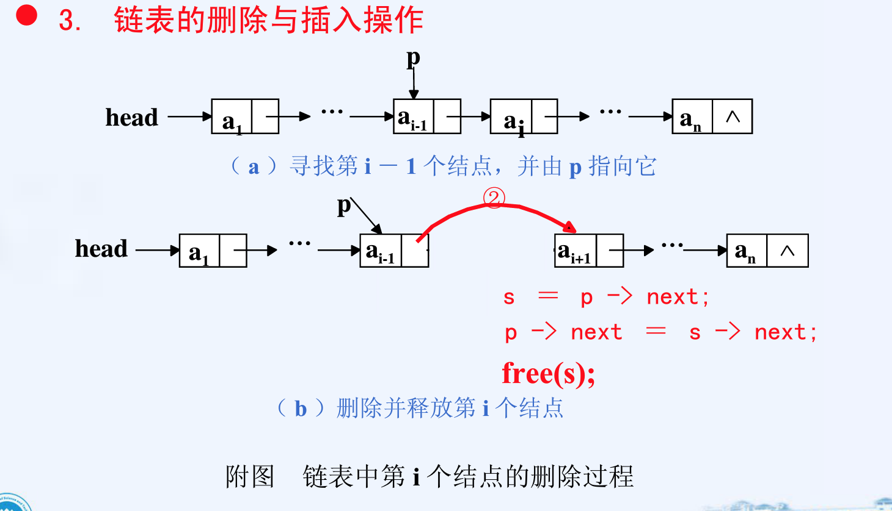
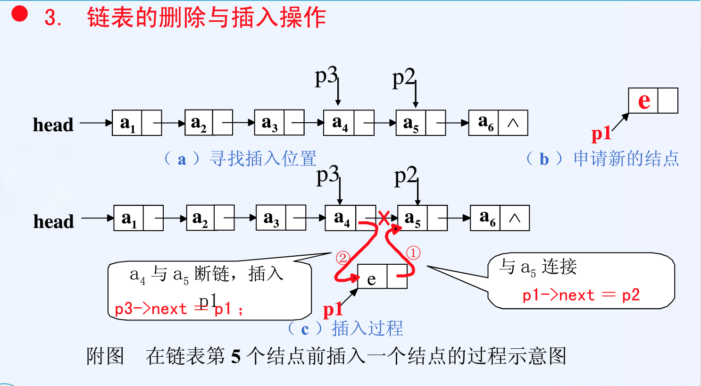

---
title:辅导
tags: 新建,模板,小书匠
grammar_cjkRuby: true
---
# Database
https://www.cnblogs.com/muchen/p/5258197.html
https://blog.csdn.net/belen_xue/article/details/52763629
online sql console https://www.codecademy.com/learn/learn-sql
from ppt: http://sqlfiddle.com/#!9/4d0d0c/306

约束（constraint） https://blog.csdn.net/bzhxuexi/article/details/43671251


relational algebra:
https://blog.csdn.net/c_kite/article/details/77776145
https://blog.csdn.net/zt15732625878/article/details/52973562
https://keelii.github.io/2017/02/19/basic-operations-of-relation-algebra/

关系代数的除法：
先找到r中有而s中没有的元素a,b
然后
```
select R.A, R.B

from R , S

where R.C=S.C and R.D=S.D
```


sql groub by
http://www.w3school.com.cn/sql/sql_groupby.asp


SQL HAVING 语法
``` sql
SELECT column_name, aggregate_function(column_name)
FROM table_name
WHERE column_name operator value
GROUP BY column_name
HAVING aggregate_function(column_name) operator value
```


范式 http://blog.51cto.com/aoxiao/144545
https://blog.csdn.net/u013503014/article/details/40741905
https://blog.csdn.net/liushuijinger/article/details/12832017


# Data Structure

考题分析

recursion
分类，每一类的区别

recurision to iterative and vise versa

The reursive trace


需要另外补习的部分

running time

关于linkedlist插入／删除操作的演示

